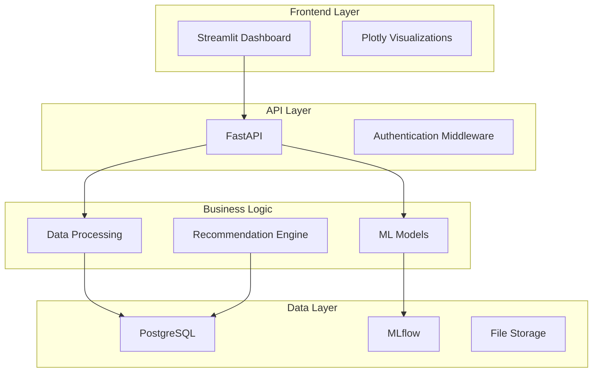

# Architecture Technique

## Vue d'ensemble

L'application suit une architecture modulaire avec séparation claire des couches pour scalabilité et maintenance.

## Diagramme Mermaid

```mermaid
graph TB
    subgraph Frontend Layer
        A[Streamlit Dashboard]
        B[Plotly Visualizations]
    end

    subgraph API Layer
        C[FastAPI]
        D[Authentication Middleware]
    end

    subgraph Business Logic
        E[ML Models]
        F[Data Processing]
        G[Recommendation Engine]
    end

    subgraph Data Layer
        H[PostgreSQL]
        I[MLflow]
        J[File Storage]
    end

    A --> C
    C --> E
    C --> F
    E --> I
    F --> H
    G --> H
```
